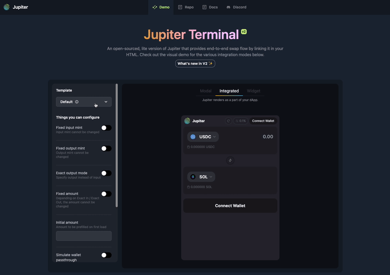
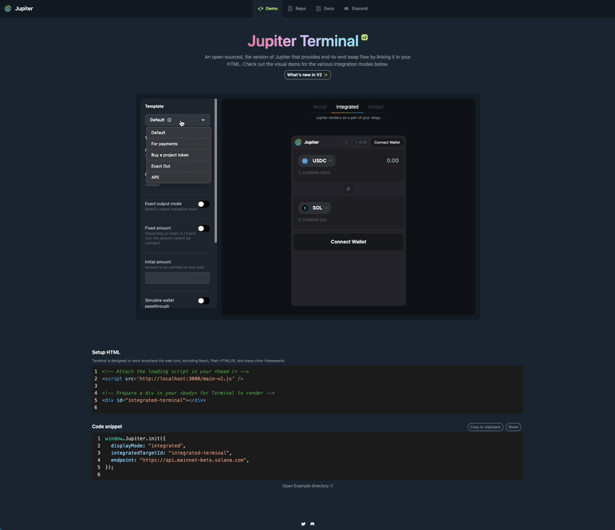

# Jupiter Terminal

Jupiter Terminal is an open-sourced, lite version of Jupiter that provides end-to-end swap flow by linking it in your HTML.

Visit our Demo / Playground over at https://terminal.jup.ag

With several templates to get you started, and auto generated code snippets.



---

## Breaking change v1 to v2

- Fee token account updated to use Jupiter referral token account. Check out [Fee supports section](#fee-supports)

---

## Core features

- `main-v2.js` bundle (~73.6Kb gzipped)

  - app bundle (~952Kb gzipped) are loaded on-demand when `init()` is called
  - alternatively, preload app bundle with `data-preload` attributes

- Agnostic

  - Work with any dApp, `Integrated` or as a standalone `Widget`, or `Modal`
  - Any framework, React, Plain HTML, and other frameworks.
  - Responsive on any screen size

- Form customisation

  - From Full swap experience, Payment Flow, to Ape-ing tokens
  - Fixed input/output amount, or mint
  - ExactIn, and ExactOut (e.g. Payment) swap mode

- Built-in Wallets

  - Wallet Standard
  - Passthrough Wallet from your dApp
  - Powered by [Unified Wallet Kit](https://github.com/TeamRaccoons/wallet-kit)

- Lite, but powerful

  - Jupiter v6 API with Metis **(New✨)**
  - State sharing with syncProps() **(New✨)**
  - Price API integration, with high decimal/precision support to trade meme tokens
  - ExactOut (e.g Payment)

- Fees Support
  - Customisable fees
  - Track fees with Jupiter Referral Dashboard

---

## Getting started

- [Demo + Auto Code Gen](https://terminal.jup.ag)
- [TLDR Example](https://github.com/jup-ag/terminal/tree/main/src/content)

- Step by step 👇

### 1. Setup HTML

Terminal is designed to work anywhere the web runs, including React, Plain HTML/JS, and many other frameworks.

```html
<!-- Attach the loading script in your <head /> -->
<script src="https://terminal.jup.ag/main-v2.js" />

<!-- Optionally, preload for better experience, or integrated mode -->
<script src="https://terminal.jup.ag/main-v2.js" data-preload />
```

### 2. Initialize Jupiter Terminal

#### Scenario 1: Terminal as part of your dApp (Passthrough Wallet)

Your dApp already has a `<WalletProvider />`.

```tsx
window.Jupiter.init({ enableWalletPassthrough: true });
```

Then, syncronise wallet state between your dApp and Jupiter Terminal with `syncProps()`

```tsx
import { useWallet } from '@solana/wallet-adapter-react'; // Or @jup-ag/wallet-adapter;

const passthroughWalletContextState = useWallet();
useEffect(() => {
  if (!window.Jupiter.syncProps) return;
  window.Jupiter.syncProps({ passthroughWalletContextState });
}, [passthroughWalletContextState.connected, props]);
```

#### Scenario 2: Standalone Terminal

Your dApp does not have a `<WalletProvider />`, or is a plain HTML/JS website.

```tsx
window.Jupiter.init({});
```

### 3. Setup other props

```tsx
window.Jupiter.init({
  /** Required
   * Solana RPC endpoint
   * We do not recommend using the public RPC endpoint for production dApp, you will get severely rate-limited
   */
  endpoint: 'https://api.mainnet-beta.solana.com',
  // ...other props
});
```

### 4. Finishing touches

Terminal are light, but full of features, such as customising form behaviour, fees, styling and much more.

[Go to our Demo](https://terminal.jup.ag) to explore all these features, with automagically generated integration code.

Or, [check out our fully typed API reference](https://github.com/jup-ag/terminal/blob/main/src/types/index.d.ts) for more details.



---

<br/>
<br/>
<br/>

## Additional API Reference

### Typescript Support

Since Jupiter Terminal is not published on npm, and are only importable via CDN, to get proper typing, you can create a typing decalarion `jupiter-terminal.d.ts` file in your project, and copy the contents in [src/types/index.d.ts](https://github.com/jup-ag/terminal/blob/main/src/types/index.d.ts)

```tsx
declare global {
  interface Window {
    Jupiter: JupiterTerminal;
  }
}
// ...
// ...
// ...
```

---

### Fee supports

Similar to Jupiter, Jupiter Terminal supports fee for integrators.

There are no protocol fees on Jupiter, but integrators can introduce a platform fee on swaps. The platform fee is provided in basis points, e.g. 20 bps for 0.2% of the token output.

Refer to [Adding your own fees](https://docs.jup.ag/docs/apis/adding-fees) docs for more details.

_Note: You will need to create the Token fee accounts to collect the platform fee._

#### By referral key `referralAccount` (easiest)
```tsx
const TEST_PLATFORM_FEE_AND_ACCOUNTS = {
  referralAccount: '2XEYFwLBkLUxkQx5ZpFAAMzWhQxS4A9QzjhcPhUwhfwy',
  feeBps: 100,
};

window.Jupiter.init({
  // ...
  platformFeeAndAccounts: TEST_PLATFORM_FEE_AND_ACCOUNTS,
})
```


#### By defined fee accounts
Alternatively, you can derive yourself the fee accounts via 
[Set your fee token account](https://docs.jup.ag/docs/apis/adding-fees#3-set-your-fee-token-account) and declare them like so:
```tsx
const TEST_PLATFORM_FEE_AND_ACCOUNTS = {
  feeBps: 100,
  feeAccounts,
};

window.Jupiter.init({
  // ...
  platformFeeAndAccounts: TEST_PLATFORM_FEE_AND_ACCOUNTS,
})
```

---

### Resuming / Closing activity

- Everytime `init()` is called, it will create a new activity.

- If you want to resume the previous activity, you can use `resume()`.

- `close()` function only hide the widget.

```tsx
if (window.Jupiter._instance) {
  window.Jupiter.resume();
}

window.Jupiter.close();
```

### Strict Token List

- `strictTokenList?: boolean;`
- Default: `true`

The Jupiter Token List API is an open, collaborative, and dynamic token list to make trading on Solana more transparent and safer for users and developers.
It is true by default to ensure that only validated tokens are shown.

Learn more at: https://station.jup.ag/docs/token-list/token-list-api

---

### Default Explorer

- `defaultExplorer?: 'Solana Explorer' | 'Solscan' | 'Solana Beach' | 'SolanaFM';`
- Default: `Solana Explorer`

The default explorer is set to `Solana Explorer`;

You can change the default explorer by passing in the explorer name to the `defaultExplorer` prop.

---

### Terminal callbacks

Callbacks that may be useful for your dApp, from form updates, to swap success/error.

```tsx
window.Jupiter.init({
  /** Callbacks */
  /** When an error has occured during swap */
  onSwapError ({ error, quoteResponseMeta }: { error TransactionError; quoteResponseMeta: QuoteResponseMeta | null }) {}
  /** When a swap has been successful */
  onSuccess ({ txid, swapResult, quoteResponseMeta }: { txid: string; swapResult: SwapResult; quoteResponseMeta: QuoteResponseMeta | null }) {}
  /** Callback when there's changes to the form */
  onFormUpdate (form: IForm) {}
  /** Callback when there's changes to the screen */
  onScreenUpdate (screen: IScreen) {}
  
  /** Advanced usage */
  /** onRequestIxCallback(), refer to dedicated section below */
});
```

### Customising styles: CSSProperties

Any CSS-in-JS can be injected to the outer-most container via containerStyles api.

Examples:

- Custom zIndex

```tsx
window.Jupiter.init({
  // ...
  containerStyles: { zIndex: 100 },
});
```

- Custom height

```tsx
window.Jupiter.init({
  // ...
  containerStyles: { maxHeight: '90vh' },
});
```

### Customising className: Tailwind className

Tailwind classes can be injected to the outer-most container via containerClassName api.

Example:

- Custom breakpoints

```tsx
window.Jupiter.init({
  // ...
  containerClassName: 'max-h-[90vh] lg:max-h-[600px]',
});
```

### onRequestIxCallback

Request Terminal to return instructions instead of transaction, so you can compose using the instructions returned.

Be sure to return `SwapResult` back to Terminal, so Terminal can handle screen/state transitioning.

- [Station Guide](https://station.jup.ag/docs/apis/swap-api#instructions-instead-of-transaction)
- [Code example](https://github.com/jup-ag/terminal/blob/main/src/content/advanced/RequestIxIntegratedTerminal.tsx)

```tsx
const onRequestIxCallback: IInit['onRequestIxCallback'] = async (ixAndCb) => {};
```

### maxAccounts

Limit the number of accounts to be used by the Swap Instructions.

- [Station Guide](https://station.jup.ag/docs/apis/swap-api#using-maxaccounts)
- [Code example](https://github.com/jup-ag/terminal/blob/main/src/content/advanced/RequestIxIntegratedTerminal.tsx)

---

### Upcoming feature / Experimentation

- [ ] Limit Order
- [ ] DCA
- [ ] Experiment separate bundle for passthroughWallet
- [ ] optimise getTABO
