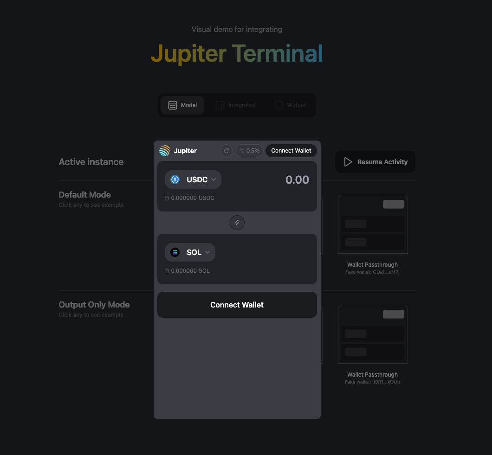
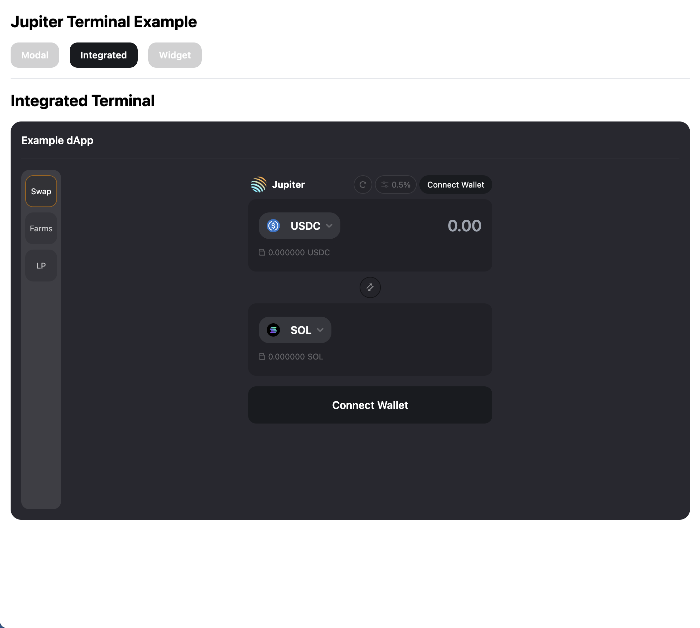
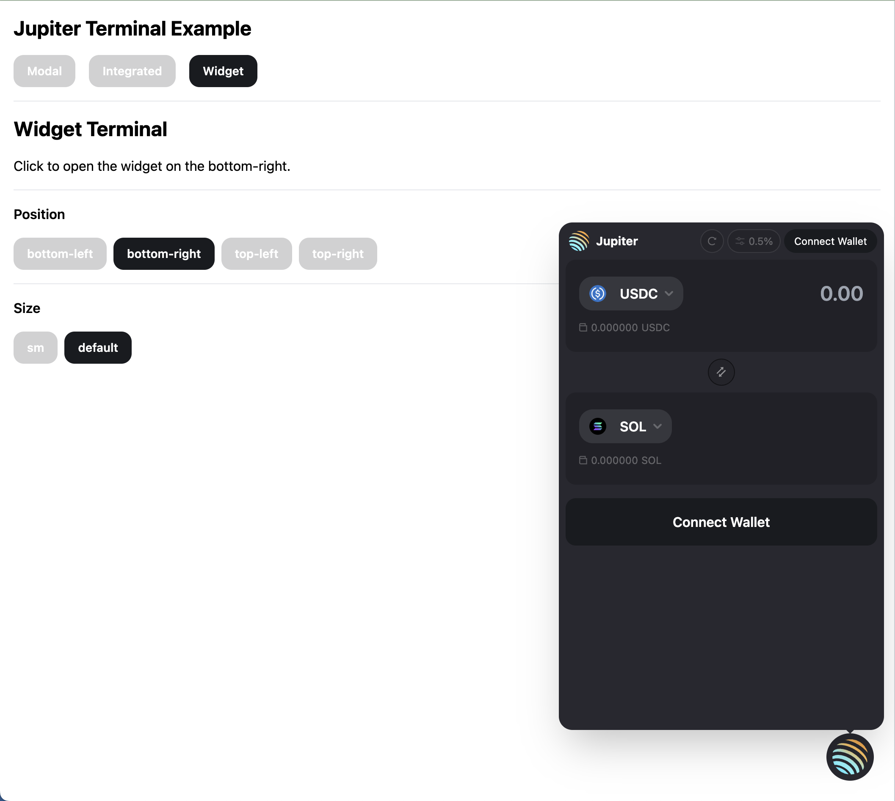

# Jupiter Terminal

Jupiter Terminal is an open-sourced, lite version of Jupiter that provides end-to-end swap flow by linking it in your HTML.

Visit our Demo / Playground over at https://terminal.jup.ag

With several templates to get you started, and auto generated code snippets.

---

## Core features

// TODO: update size
- `main-v2.js` bundle (~73.6Kb gzipped)
  - app bundle (~952Kb gzipped) are loaded on-demand when `init()` is called
  - alternatively, preload app bundle with `data-preload` attributes

// TODO: WalletStandard, and UnifiedWallet
- Several major built-in wallets, or passthrough wallets from your dApp
- Flexible display modes, `Modal`, `Integrated`, or `Widget`.
- Flexible form customisation, e.g. Full swap experience, Payment flow.
// TODO: to referral doc
- Fee supports
- Support ExactIn, and ExactOut swap mode
- Auto wallet detection for Versioned Tx.
- Price API integration, high precisions and meme tokens
// TODO: 
- v6 API supports
- ExactOut
- syncProps()
- UnifiedWalletAdapter https://github.com/TeamRaccoons/wallet-kit

---

## Getting started

### Integrating the widget

In your document, link and embed `main-v2.js`.

```tsx
<script src="https://terminal.jup.ag/main-v2.js" data-preload />
```

### Preloading Terminal

Assign the attribute `data-preload` to the script tag, the full application will be preloaded on your browser's `(document.readyState === "complete")` event.

```tsx
<script src="https://terminal.jup.ag/main-v2.js" data-preload />
```

Then,

```tsx
document.addEventListener('readystatechange', e => {
  if (document.readyState === "complete") {
    window.Jupiter.init({ endpoint: 'https://api.mainnet-beta.solana.com' });
  }
});
```

---


## Built-in wallets, or passthrough wallets from your dApp
**If your dApp already have a `<WalletProvider />`, it is a requirement to use `passthroughWallet` to ensure proper Wallet Standard support.**

_*Mode 1: Wallet passthrough*_

If your user have connected their wallet via your dApp, you may passthrough the wallet instance via the `init({ passThroughWallet: wallet })`.

// TODO: Update this props
```jsx
const App = () => {
  const { wallet } = useWallet();

  const initJupiter = () => {
    if (wallet) {
      window.Jupiter.init({
        endpoint,
        passThroughWallet: wallet,
      });
    }
  };
};
```

_*Mode 2: Built-in wallet*_

If your user is not connected, Jupiter Terminal have several built-in wallets that user can connect and perform swap directly.

---

### Modal, Integrated, or Widget mode.

### _*Modal*_

By default, Jupiter renders as a modal and take up the whole screen.


```tsx
window.Jupiter.init({ displayMode: 'modal' });
```

// TODO: Integrated guide should include <div /> and targets
### _*Integrated*_

Integrated mode renders Jupiter Terminal as a part of your dApp.


```tsx
window.Jupiter.init({ displayMode: 'integrated' });
```

### _*Widget*_


Widget mode renders Jupiter Terminal as a widget that can be placed at different position.

````tsx

```tsx
window.Jupiter.init({
  displayMode: 'widget',
  widgetStyle: {
        position: 'bottom-right', // 'bottom-left', 'top-left', 'top-right'
        size: 'default', // 'sm'
      },
});
````

---

### formProps

Configure Terminal's behaviour and allowed actions for your user

- swapMode?: `SwapMode.ExactIn | SwapMode.ExactOut`
  - Default to `ExactIn`, where user input the amount of token they want to swap.
  - On `ExactOut`, user input the desired amount of token they want to receive.
- initialAmount?: `string`
  - The initial amount
- fixedAmount?: `boolean`
  - The initial amount is fixed, user cannot change the amount.
  - Depending on swapMode, fixedAmount will be applied to input or output amount.
- initialInputMint?: `string`
  - The default input mint
  - can be used with `fixedInputMint`
- fixedInputMint?: `boolean`
  - must be used with `initialInputMint`
  - user cannot change the input mint
- initialOutputMint?: `string`
  - The default output mint
  - can be used with `fixedOutputMint`
- fixedOutputMint?: `boolean`
  - must be used with `initialInputMint`
  - user cannot change the input mint

---

### Resuming / Closing activity

- Everytime `init()` is called, it will create a new activity.

- If you want to resume the previous activity, you can use `resume()`.

- `close()` function only hide the widget.

```tsx
if (window.Jupiter._instance) {
  window.Jupiter.resume();
}

window.Jupiter.close();
```

---

// TODO: Update to referral doc
### Fee supports

Similar to Jupiter, Jupiter Terminal supports fee for integrators.

There are no protocol fees on Jupiter, but integrators can introduce a platform fee on swaps. The platform fee is provided in basis points, e.g. 20 bps for 0.2% of the token output.

Refer to [Adding your own fees](https://docs.jup.ag/integrating-jupiter/additional-guides/adding-your-own-fees) docs for more details.

_Note: You will need to create the Token fee accounts to collect the platform fee._

```tsx
import { getPlatformFeeAccounts } from '@jup-ag/react-hook';

// Jupiter Core provides a helper function that returns all your feeAccounts
const platformFeeAndAccounts = {
  feeBps: 50,
  feeAccounts: await getPlatformFeeAccounts(
    connection,
    new PublicKey('BUX7s2ef2htTGb2KKoPHWkmzxPj4nTWMWRgs5CSbQxf9'), // The platform fee account owner
  ), // map of mint to token account pubkey
};

window.Jupiter.init({
  // ...
  platformFeeAndAccounts,
});
```

### Strict Token List
- `strictTokenList?: boolean;`
- Default: `true`

The strict list contains a smaller set of validated tokens. To see all tokens, toggle "off".

Learn more at: https://docs.jup.ag/api/token-list-api

---

### Default Explorer
- `defaultExplorer?: 'Solana Explorer' | 'Solscan' | 'Solana Beach' | 'SolanaFM';`
- Default: `Solana Explorer`

The default explorer is set to `Solana Explorer`;

You can change the default explorer by passing in the explorer name to the `defaultExplorer` prop.

---

### onSuccess/onSwapError callback

`onSuccess()` reference can be provided, and will be called when swap is successful.

While `onSwapError()` will be called when an error has occurred.

```tsx
window.Jupiter.init({
  onSuccess: ({ txid, swapResult }) => {
    console.log({ txid, swapResult });
  },
  onSwapError: ({ error }) => {
    console.log('onSwapError', error);
  },
});
```

### Customising styles: CSSProperties

Any CSS-in-JS can be injected to the outer-most container via containerStyles api.

Examples:

- Custom zIndex

```tsx
window.Jupiter.init({
  // ...
  containerStyles: { zIndex: 100 },
});
```

- Custom height

```tsx
window.Jupiter.init({
  // ...
  containerStyles: { maxHeight: '90vh' },
});
```

### Customising className: Tailwind className

Tailwind classes can be injected to the outer-most container via containerClassName api.

Example:

- Custom breakpoints

```tsx
window.Jupiter.init({
  // ...
  containerClassName: 'max-h-[90vh] lg:max-h-[600px]',
});
```

---

### Typescript Support
Since Jupiter Terminal is not published on npm, and are only importable via CDN, to get proper typing, you can create a typing decalarion `jupiter-terminal.d.ts` file in your project, and copy the contents in `src/types/index.d.ts`.

```tsx
declare global {
  interface Window {
    Jupiter: JupiterTerminal;
  }
}
// ...
// ...
// ...
```

### Upcoming feature / Experimentation
- [ ] Limit Order
- [ ] DCA
- [ ] Experiment separate bundle for passthroughWallet
