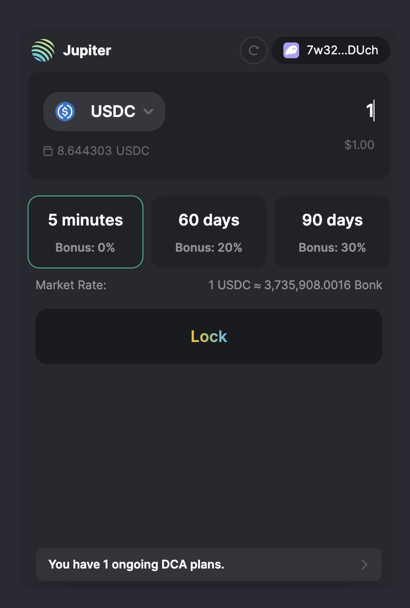
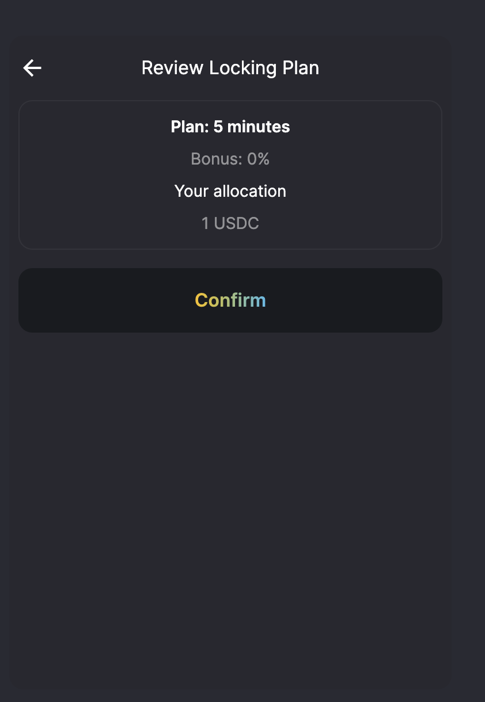
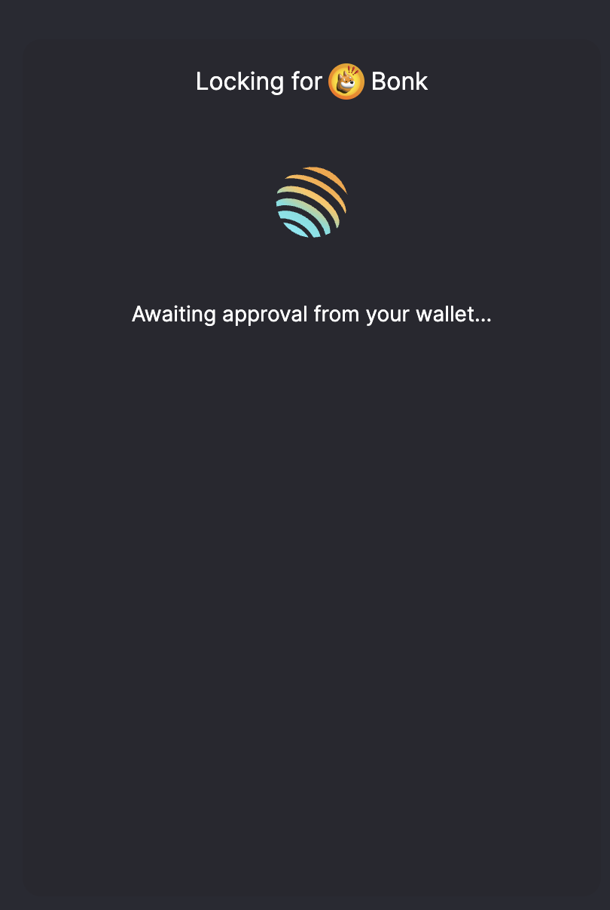
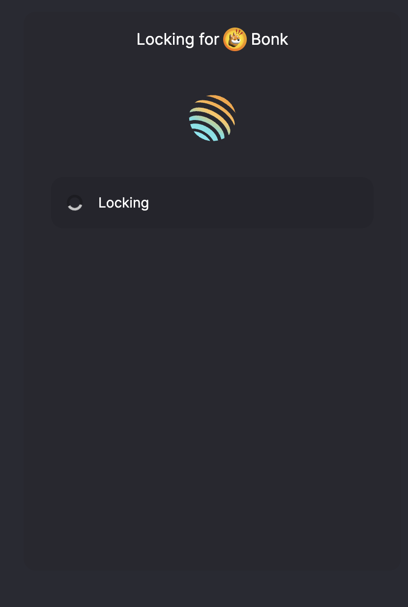
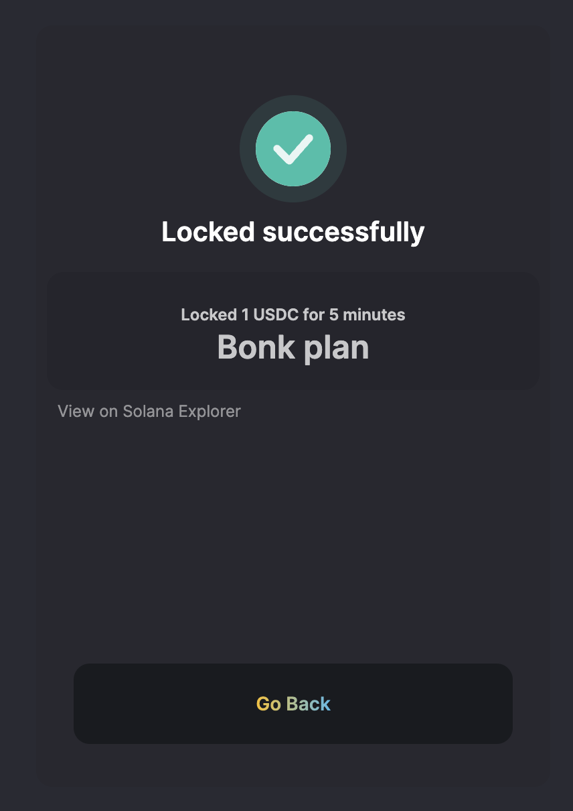
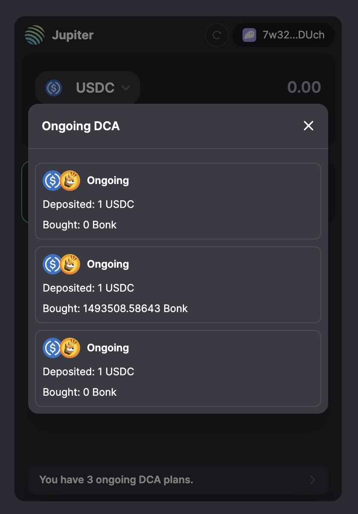

# Locked DCA

A demo app experience for Locked DCA.

## Demo








## Getting Started

- Clone the repo
- pnpm i
- pnpm dev

## Craft new plans

- Plans are hardcoded on the Frontend, and enforce-able on the contract.
- src/contexts/SwapContext.tsx

```tsx
export const SECONDS_IN_MINUTE = 60; // 1 minute
export const SECONDS_IN_DAY = 86400; // 1 day
export const LOCKING_PLAN: ILockingPlan[] = [
  {
    name: `5 minutes`,
    incetivesPct: 0,
    cycleSecondsApart: SECONDS_IN_MINUTE, // executed per minute
    numberOfTrade: 5,
  },
  {
    name: `60 days`,
    incetivesPct: 20,
    cycleSecondsApart: SECONDS_IN_DAY,
    numberOfTrade: 60, // executed daily
  },
  {
    name: `90 days`,
    incetivesPct: 30,
    cycleSecondsApart: SECONDS_IN_DAY,
    numberOfTrade: 90, // executed daily
  },
];
```

Many UI elements forked from `https://terminal.jup.ag`
